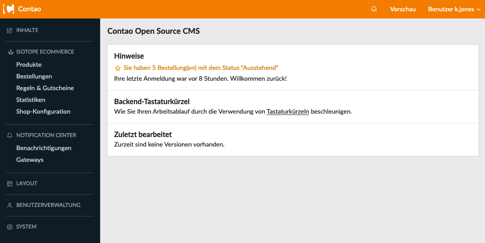

{}
This article is machine translated.
{}

Here you have order number, placement date, billing address and order status listed in one overview.

## Filter &amp; Sort

Here you can filter the shop orders according to various properties.

<table><thead><tr><th>Filter name</th> <th>Meaning</th> </tr></thead><tbody><tr><td>Placed</td> <td>Filters the orders by their date of receipt in months.</td> </tr><tr><td>Order status</td> <td>Filters the purchase orders according to their status.</td> </tr><tr><td>Payment method</td> <td>Filters the orders by their selected payment method.</td> </tr><tr><td>Shipping method</td> <td>Filters the orders by the selected shipping method.</td></tr></tbody></table>

{}
The

filters always show for selection what is already in the list, not all possibilities which are basically available

. 
{}
 You can sort by `Bestellnummer`, `Bestellstatus` and `Platziert`.

## Editing possibilities of the individual orders

### 1. edit

<table><thead><tr><th>Setting</th> <th>Default setting</th> <th>Description</th> </tr></thead><tbody><tr><td>Order status</td> <td>Depending on which statuses are automatically assigned by the system. You can set this in the shop configurations.</td> <td>Here you can change the status of the order manually.</td> </tr><tr><td>Payment date</td> <td>-</td> <td>Here you can enter the date when a customer has paid for example cash/advance payment.</td> </tr><tr><td>Shipping date</td> <td>-</td> <td>Here you can record the date of dispatch.</td> </tr><tr><td>Order notes</td> <td>-</td> <td>Remarks for other users in the backend.</td></tr></tbody></table>

### 2. detailed information about individual orders

Next to the info button on the right there are three more buttons available.

- Via the **payment method button** () you can view information that goes along with the payment process. For example, if the buyer paid with Paypal, the transaction code is displayed here.
- The same kind of information is provided by the **shipping method button** (). For example, you might see a tracking number here. This largely depends on the shipping providers, what information they return and if the developer of the shipping or payment method has implemented it.
- With the **PDF button** () you can for example generate an invoice or a delivery note. You can create and customize the templates yourself.

## Other

### New orders are displayed on the start page.

### Configure orders

Under [Shop Configuration](/de/backend-konfiguration-shop-allgemein-konfiguration/) you can configure the orders.

