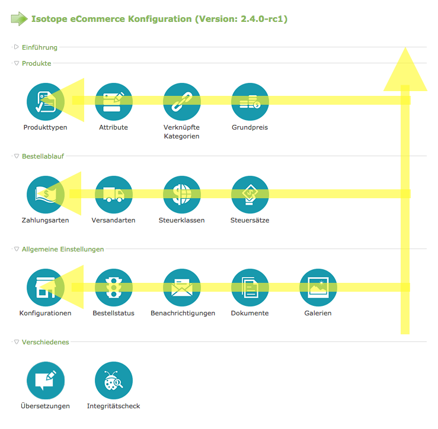

Isotope eCommerce bietet eine Vielzahl an Konfigurationsmöglichkeiten. Viele Einstellungen beziehen sich dabei auf andere bzw. sind von ihnen abhängig. Es bietet sich deshalb an, eine gewisse Bearbeitungsreihenfolge einzuhalten, um den Aufwand zu minimieren.

Grundsätzlich fängst du immer unten rechts an und arbeitest dich nach oben hoch. Später wirst du fast nur noch die oberen Einstellungen benötigen, weshalb wir uns für diese Reihenfolge entschieden haben.

Die einzigen Ausnahmen dazu sind die <docrobot_route name="translations">Übersetzungen</docrobot_route> und der <docrobot_route name="integrity-check">Integritätscheck</docrobot_route>, welche du natürlich ohnehin nur dann benötigst, wenn du mehrsprachige Shops betreibst oder einen Integritätscheck für deine Installation durchführen möchtest. Dieser Konfigurationspunkt befindet sich deshalb immer ganz unten.

Bildlich dargestellt ergibt sich folgende Reihenfolge:

Du wirst feststellen, dass die Navigation in diesem Handbuch anhand der vier Legenden (die grünen Abtrennungen) und dann den entsprechenden Konfigurationspunkten aufgebaut ist. Folglich geht es wie folgt weiter:

{}