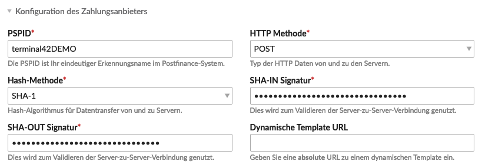
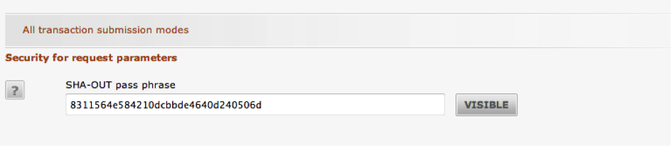

{}
This payment method is no longer supported by PostFinance and has been replaced by [PostFinance Checkout Flex](../payment-pfc/).
{}

{}
This article is machine translated.
{}

This document describes the integration of the payment type "PostFinance". Further information can be [found on the corresponding website](https://www.postfinance.ch/de/biz/prod/eserv/epay.html).

## Configuration of the payment provider

The basic data for linking the PostFinance e-payment system is entered here.

<table><thead><tr><th>Setting</th> <th>Default setting</th> <th>Description</th> </tr></thead><tbody><tr><td>PSPID</td> <td>-</td> <td>Here you have to enter your PSPID. You will receive the PSPID from PostFinance. If you are in test mode, please make sure that the PSPID ends with "DEMO".</td> </tr><tr><td>HTTP method</td> <td>-</td> <td>PostFinance supports the exchange of data via POST as well as via GET. You can choose what you want as long as the same method is selected in both Isotope eCommerce and the PSP interface. Generally POST is the better choice.</td> </tr><tr><td>Hash method</td> <td>-</td> <td>PostFinance supports different hashing methods. You can choose whatever you want as long as the same method is selected in both Isotope eCommerce and the PSP interface. Generally SHA-1 is sufficient.</td> </tr><tr><td>SHA-IN signature</td> <td>-</td> <td>Here you need to enter an arbitrary hash which will be used to sign the exchanged data. Make sure that you use the same algorithm as you selected in "Hash Method". There are [many hash generators](http://hash.online-convert.com) that can generate a hash from any security key. Also, make sure you enter the hash as a lowercase hexadecimal string. The hash you enter here must also be entered in the PSP interface under "SHA-IN Signature". This allows both the PSP and Isotope eCommerce to verify the accuracy of the data.</td> </tr><tr><td>SHA-OUT Signature</td> <td>-</td> <td>Here you need to enter any hash which will be used to sign the exchanged data. Make sure you use the same algorithm as you selected in "Hash Method". There are [many hash generators](http://hash.online-convert.com) that can generate a hash from any security key. Also, make sure you enter the hash as a lowercase hexadecimal string. The hash you enter here must also be entered in the PSP interface at "SHA-OUT Signature". This allows both the PSP and Isotope eCommerce to verify the accuracy of the data.</td> </tr><tr><td>Predefined payment method</td> <td>-</td> <td>By default, the customer selects the desired payment method (VISA, MasterCard, etc.) on the PostFinance page. However, you can also make the selection on your page and choose here which payment method he should be automatically redirected to. By defining several payment methods of the type PostFinance and selecting other payment methods in this field, you can let your customer choose the desired payment method already on the pages of your shop.</td></tr></tbody></table>

Finally, it should look something like this:

## Release

<table><thead><tr><th>Setting</th> <th>Default setting</th> <th>Description</th> </tr></thead><tbody><tr><td>Use test system</td> <td>-</td> <td>Check this box if you want to work in test mode. Requests will then automatically go to the test system and not the production system.</td> </tr><tr><td>Enable logging</td> <td>-</td> <td>Write transaction information to the system log files.</td></tr></tbody></table>

## Configuring the PSP Interface

The next step is to configure the PSP interface. All subsequent configurations are done in "Configuration &gt; Technical information".

### Tab "Global security parameters

Make sure that the settings match the picture above. You have to adjust the "Hash algorithm" according to your configuration in Isotope eCommerce.

### Tab "Data and origin verification

Make sure you enter the correct URL/domain to your webshop here. The PostFinance PSP system validates all incoming requests and checks if the origin corresponds to a valid URL. If you enter a wrong page here, you will get an error "unknown order/1/r" (see error logs in the Postfinance backend).

Then enter the exact same SHA-IN signature as you entered before in Isotope eCommerce.

{}
Please

note the difference between SHA-IN and SHA-OUT!

{}
 ### Tab "Transaction feedback

Scroll down to "Direct HTTP server-to-server request" and set "Timing of the request" according to the image above. The URL's are identical for both and should be set up as follows:

> "The URL to your webshop"/system/modules/isotope/postsale.php

{}
Make

sure that this URL is reachable over the internet. That means you have to make sure that you have not protected the page with a `.htaccess`-protection for example. Otherwise, the payment feedback will fail and Isotope eCommerce will not be able to complete the order.

{}
 Finally, set the "Request method" according to the one you selected in Isotope eCommerce during the payment method setup.

Don't forget to add the SHA-OUT signature. Again, it must match the configuration in Isotope eCommerce.

{}
Please

note the difference between SHA-IN and SHA-OUT!

{}
 That's it! You can now enjoy Isotope eCommerce together with payments via PostFinance e-Payment.

## PostFinance with FIS Integration

{}
This

feature is currently disabled and is being tested in cooperation with PostFinance. As soon as the corresponding functions are available in the Isotope eCommerce Core, the documentation will be added here
{}
.
