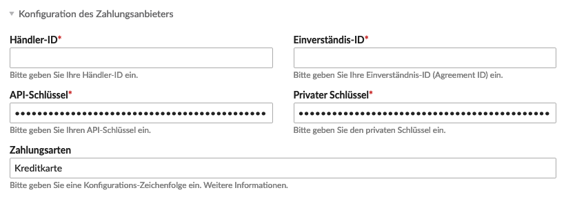

QuickPay ist ein dänischer Zahlungsanbieter, der seit 2004 seine Leistungen anbietet. Weitere Informationen bietet [die Firmenwebsite][1].

Der Prozess erfordert ein QuickPay Konto, dass dir die Informationen liefert, um ein entsprechendes Zahlungsfenster deinen Kunden zur Verfügung zu stellen.

{}
Du brauchst auch noch ein Konto mit einem Zahlungsunternehmen, dass dir den eigentlichen Geldverkehr (tatsächliche Kontobelastung / -gutschrift) erledigt. Im Falle von QuickPay kannst du das Zahlungsunternehmen innerhalb deines QuickPay Kontos auswählen und entsprechend benutzen. Selbstverständlich brauchst du auch ein gesonderten Vertrag mit dem Zahlungsunternehmen.
{}

## Allgemeine Einstellungen

<table>
	<thead>
		<tr>
			<th>Einstellung</th>
			<th>Standardeinstellung</th>
			<th>Beschreibung</th>
		</tr>
	</thead>
	<tbody>
		<tr>
			<td>Transaktions-Typ</td>
			<td>Autorisieren und Einnehmen</td>
			<td>Hier kannst du den Transaktions-Typ bestimmen.  
				<ul>
				<li><strong>Autorisieren und Einnehmen</strong> 
				Transaktionen von diesem Typ werden für die Authorisierung gesendet. Die Transaktion wird automatisch zur Begleichung geleitet wenn die Transaktion erfolgreich war.</li>
				<li><strong>Nur Autorisieren</strong> 
				Transaktionen dieses Typs werden übertragen, wenn der Händler die Kreditkarte auf die Menge der verkauften Waren prüfen lassen möchte. Wenn der Händler nicht genügend Waren im Lager hat oder die Bestellungen vor der Warenlieferung prüfen möchte, wird dieser Transaktiontyps übertragen.</li>
				</ul>
			</td>
		</tr>
	</tbody>
</table>

## Konfiguration des Zahlungsanbieters

<table>
	<thead>
		<tr>
			<th>Einstellung</th>
			<th>Standardeinstellung</th>
			<th>Beschreibung</th>
		</tr>
	</thead>
	<tbody>
	<tr>
		<td>Händler-ID</td>
		<td>-</td>
		<td>Entspricht im QuickPay der Merchant-ID</td>
	</tr>
	<tr>
		<td>Einverständnis-ID</td>
		<td>-</td>
		<td>Entspricht im QuickPay der Payment Window - Agreement ID.</td>
	</tr>
	<tr>
		<td>API-Schlüssel</td>
		<td>-</td>
		<td>Entspricht im QuickPay dem Payment Window - API KEY Schlüssel</td>
	</tr>
	<tr>
		<td>Privater Schlüssel</td>
		<td>-</td>
		<td>Entspricht im QuickPay der Merchant information - Private Key.</td>
	</tr>
	<tr>
		<td>Zahlungsarten</td>
		<td>creditcard</td>
		<td>Hier kannst du die mit dem Zahlungsunternehmen vereinbarten Zahlungsarten hinterlegen. <a href="https://learn.quickpay.net/tech-talk/appendixes/payment-methods/">Weitere Informationen</a></td>
	</tr>
		</tr>
	</tbody>
</table>

## Freigabe

<table>
	<thead>
		<tr>
			<th>Einstellung</th>
			<th>Standardeinstellung</th>
			<th>Beschreibung</th>
		</tr>
	</thead>
	<tbody>
		<tr>
			<td>Aktiviere das Logging</td>
			<td>-</td>
			<td>Schreiben Sie Transaktionsinformationen in die Systemprotokolldateien.</td>
		</tr>
	</tbody>
</table>

Hier eine bildliche Hilfe des Feldmappings:

QuickPay:

und das entsprechende Mapping in Isotope:

[1]: https://www.quickpay.net/
