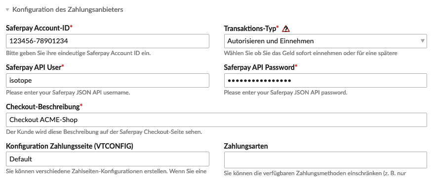
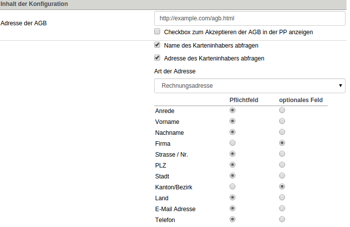

{}
This article is machine translated.
{}

[Saferpay](https://www.six-payment-services.com/de/site/e-commerce/solutions/paymentsolution.html) is a service with which, among other things, credit card payments can be made. To use the service, you must first apply for a test account or sign a contract with the service provider.

## Configuration of the payment provider

When creating the payment method, you have to enter the following data for the link with Saferpay:

<table><thead><tr><th>Setting</th> <th>Default setting</th> <th>Description</th> </tr></thead><tbody><tr><td>Saferpay Account ID</td> <td>-</td> <td> The account ID, which is sent by e-mail. {}The Saferpay account ID is made up of the customer ID (6 digits) and the terminal number (8 digits). You can find it in the back office of SAFERPAY under Transactions &gt; Webshop &gt; Settings. The format of the ID `123456-12345678`.
{}
. </td> </tr><tr><td>Transaction type</td> <td>Authorize and collect</td> <td>Here you can specify the transaction type. - **Authorize and collect** Transactions of this type are sent for authorization. The transaction is automatically routed for settlement if the transaction was successful.
- **Authorize Only** Transactions of this type are sent when the merchant wants to have the credit card checked for the quantity of goods sold. If the merchant does not have enough goods in stock or wants to check the orders before the goods are delivered, this transaction type will be transferred.
 
</td> </tr><tr><td>Saferpay API users</td> <td>-</td> <td> Here you can enter the Saferpay JSON API user . </td> </tr><tr><td>Saferpay API Password</td> <td>-</td> <td> Here you can enter the Saferpay JSON API password . </td> </tr><tr><td>Checkout Description</td> <td>-</td> <td>This description is what the customer will see on the Saferpay checkout page.</td> </tr><tr><td>Payment Page Configuration (VTCONFIG)</td> <td>-</td> <td> In a Saferpay account you can configure multiple Payment Pages. Here you specify the name of the payment page configuration to be used. </td> </tr><tr><td>Payment Pages</td> <td>-</td> <td>  Here you can limit the available payment methods (e.g. MasterCard only). If you do not select anything here, all payment methods are allowed. The following payment methods are available: - MasterCard
- Visa
- American Express
- Diners Club
- JCB
- &gt;Saferpay Test Card
- Laser
 
Card - Bonus
 
Card - PostFinance E-Finance
- PostFinance Card
- Maestro International
- MyOne
- Direct Debit
- Invoice
- Sofortüberweisung
- PayPal
- giropay
- iDEAL
- ClickandBuy
- Homebanking AT (eps)
- Mpass
- ePrzelewy
 
</td></tr></tbody></table>

## Configuration of the Payment Page

In the Saferpay login area, you can create and configure payment pages (PP) under *Administration* &gt; *Payment Page Configuration*.

### Payment Page Configuration

<table><thead><tr><th>Setting</th> <th>Default setting</th> <th>Description</th> </tr></thead><tbody><tr><td>Name of the configuration</td> <td>-</td> <td> A name of your choice. {}
This value is specified in the payment provider configuration in Contao in the *Payment page configuration (VTCONFIG)* field. </td> </tr><tr><td>Description</td> <td>-</td> <td> Description that will be displayed to the customer on the PP. Additionally, you can set here whether the PP is active or inactive. </td> </tr><tr><td>Mode selection</td> <td>PayInit</td> <td> Here you can select which attributes have priority: - **PayInit** Attributes in the PayInit have priority over the values specified in the form.
- **VTConfig** Values specified in the form take precedence over PayInit attributes.
 
 {}For Isotope eCommerce to process the order properly, the *PayInit* option must be selected here. Otherwise, the payment will be processed and the order will be created, but an error message will be displayed on the \[order details page\](/en/backend-page-structure/) in the shop.
{}
 </td> </tr><tr><td>Standard PP language</td> <td>-</td> <td> Here you can set the language in which the PP is to be displayed by default. In addition, the checkbox gives you the option of displaying a language selection to the customer. </td></tr></tbody></table>

### Content of the configuration

<table><thead><tr><th>Setting</th> <th>Default setting</th> <th>Description</th> </tr></thead><tbody><tr><td>Address of the AGB</td> <td>-</td> <td> Here is the URL to the terms and conditions of the shop. In addition, you can use the checkbox to set whether a checkbox for confirming the terms and conditions should be displayed on the payment page. </td> </tr><tr><td>Address fields</td> <td>-</td> <td>Various details about the fields that the customer has to fill in on the payment page. - Query the name of the cardholder
- Request address of cardholder
- Type of addressSpecify whether the address is the customer address, billing address or delivery address.
- Mandatory and optional fieldsWhich fields should be treated as mandatory or optional?
 
</td></tr></tbody></table>

### Forwarding &amp; confirmation page

<table><thead><tr><th>Setting</th> <th>Default setting</th> <th>Description</th> </tr></thead><tbody><tr><td>Enable forwarding</td> <td>-</td> <td> If the checkbox is active, the customer will be redirected to the shop after the payment process. Additionally, the delay until redirection can be specified in seconds. </td> </tr><tr><td>Address of the confirmation page after **successful** payment</td> <td>-</td> <td>URL to the order details page of the shop.</td> </tr><tr><td>Address of the confirmation page after **unsuccessful** payment</td> <td>-</td> <td>URL to the shop page informing the customer about unsuccessful payment.</td> </tr><tr><td>Address of the confirmation page in case of **payment cancellation** by the customer.</td> <td>-</td> <td>URL to the store page that confirms the customer abandoned the payment.</td> </tr><tr><td>Send e-mail confirmation</td> <td>-</td> <td> If this checkbox is enabled, you can specify who will receive a notification about the payment transaction. This function is only relevant for the shop owner, not for the customer. </td></tr></tbody></table>

### Data transfer

<table><thead><tr><th>Setting</th> <th>Default setting</th> <th>Description</th> </tr></thead><tbody><tr><td>PP should notify server</td> <td>-</td> <td> If enabled, the URL to postsale.php can be specified here. Saferpay will then notify the shop of the successful payment transaction. {}This option does not need to be enabled for the order to be created in Isotope eCommerce.
{}
 </td></tr></tbody></table>

