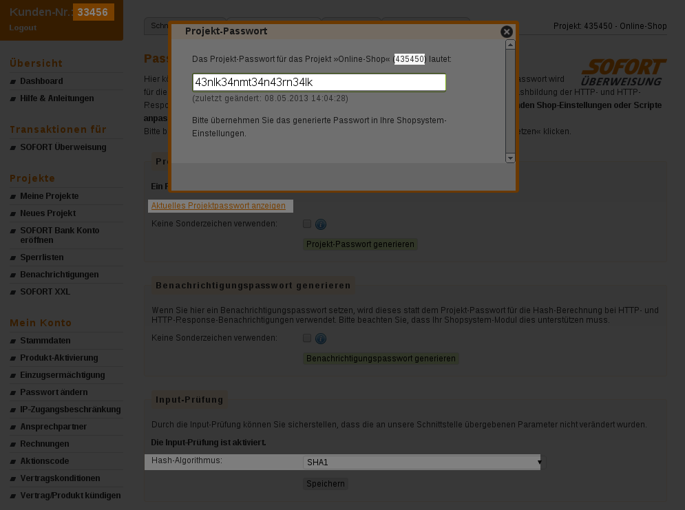
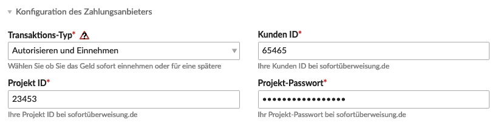
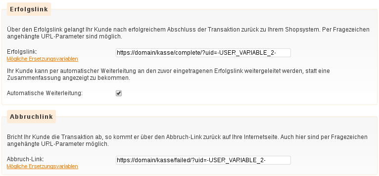
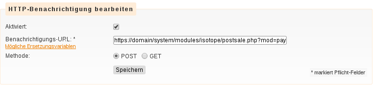
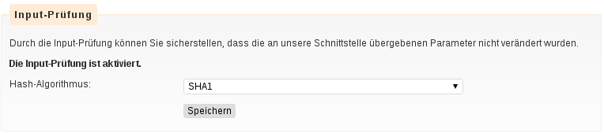

Bei Sofortüberweisungen autorisiert der Kunde die SOFORT AG, mittels einer vom Kunden bereitgestellten Onlinebanking-TAN eine Überweisung vom Konto des Kunden an den Händler vorzunehmen. Weitere Informationen bietet [die Firmenwebsite][1].

Für die Nutzung ist ein kostenpflichtiger Vertrag mit der SOFORT AG notwendig.

## Konfiguration des Zahlungsanbieters

<table>
	<thead>
		<tr>
			<th>Einstellung</th>
			<th>Standardeinstellung</th>
			<th>Beschreibung</th>
		</tr>
	</thead>
	<tbody>
		<tr>
			<td>Transaktions-Typ</td>
			<td>Autorisieren und Einnehmen</td>
			<td>Hier kannst du den Transaktions-Typ bestimmen.  
				<ul>
				<li><strong>Autorisieren und Einnehmen</strong> 
				Transaktionen von diesem Typ werden für die Authorisierung gesendet. Die Transaktion wird automatisch zur Begleichung geleitet wenn die Transaktion erfolgreich war.</li>
				<li><strong>Nur Autorisieren</strong> 
				Transaktionen dieses Typs werden übertragen, wenn der Händler die Kreditkarte auf die Menge der verkauften Waren prüfen lassen möchte. Wenn der Händler nicht genügend Waren im Lager hat oder die Bestellungen vor der Warenlieferung prüfen möchte, wird dieser Transaktiontyps übertragen.</li>
				</ul>
			</td>
		</tr>
		<tr>
			<td>Kunden ID</td>
			<td>-</td>
			<td>Die SOFORT-Kundennummer befindet sich im SOFORT-Backend linkerseits.</td>
		</tr>
		<tr>
			<td>Projekt ID</td>
			<td>-</td>
			<td>Die Projekt-ID ist ebenfalls im SOFORT-Backend zu finden, so etwa oben rechts.</td>
		</tr>
		<tr>
			<td>Projekt-Passwort</td>
			<td>-</td>
			<td>
			    Das Projekt-Passwort muss im SOFORT-Backend generiert werden und kann anschliessend in einem modalen Fenster eingesehen werden.
			    {}
(ACHTUNG: Das Benachrichtigungspasswort darf im SOFORT-Backend nicht gesetzt sein. Der Support von SOFORT kann dies löschen, falls es aus Versehen schon gesetzt wurde.
{}
			</td>
		</tr>
	</tbody>
</table>

## Freigabe

<table>
	<thead>
		<tr>
			<th>Einstellung</th>
			<th>Standardeinstellung</th>
			<th>Beschreibung</th>
		</tr>
	</thead>
	<tbody>
		<tr>
			<td>Aktiviere das Logging</td>
			<td>-</td>
			<td>Schreiben Sie Transaktionsinformationen in die Systemprotokolldateien.</td>
		</tr>
	</tbody>
</table>

Im folgenden Screenshot ist hervorgehoben, an welchen Stellen die für die Konfiguration notwendigen Daten aus dem SOFORT-Backend ausgelesen werden können:

Eine vollständige Backend-Konfiguration sollte in etwa so aussehen:

## Konfiguration im SOFORT-Backend

Im Anbietermenü von SOFORT müssen im Projekt verschiedene Einstellungen getroffen werden, damit Isotope und SOFORT richtig zusammenarbeiten. Abbrüche und Fehlermeldungen bei Bestellungen sind wahrscheinlich auf falsche Einstellungen in diesen Feldern zurückzuführen.

Im Reiter __Erweiterte Einstellungen__ existieren verschiedene Unterpunkte. Besonders wichtig sind _Shopsystem-Schnittstelle_ und _Benachrichtigungen_, jedoch sollte vor der Inbetriebnahme jede einzelne Einstellung sorgfältig kontrolliert werden.

### Einstellungen zur Shopsystem-Schnittstelle

Diese Konfiguration legt u. A. die URL fest, an die ein Käufer nach einer Transaktion zurückgeleitet wird. Üblicherweise sollte dies die Bestätigungsseite (Schritt _complete_) von Isotope eCommerce sein. Ausserdem kann eine Fehlerseite (Schritt _failed_) angegeben werden.

{}
Beachte, dass auf dem Screenshot die URL's ohne den Parameter "step" angegeben sind! Es hängt davon ab, ob du "Auto_item aktivieren" in deinen Contao System-Einstellungen aktiviert hast oder nicht. Solltest du das nicht aktiviert haben, müssen die URL's "step" enthalten (bspw. "/kasse/step/complete.html" etc.).
{}

Wichtig ist die Übergabe eines URL-Parameters, damit die Buchung von Isotope zugeordnet werden kann. Dazu muss der Bestandteil `?uid=-USER_VARIABLE_2-` an die Adresse angehängt werden. Dieser Parameter wird von SOFORT durch die von Isotope übergebene Buchungsreferenz ersetzt.

### Benachrichtigungs-Einstellungen ###

Isotope eCommerce verlässt sich nicht auf einen URL-Aufruf, den ein Benutzer selbst durchführen könnte, ohne die Zahlung tatsächlich zu leisten. Stattdessen muss SOFORT einen asynchronen Aufruf einer Isotope-Schnittstelle mit einem sog. Postsale-Request durchführen, um Isotope zu bestätigen, dass die Zahlung durchgeführt wurde. Erst danach wird der Benutzer zum Shop zurückgeleitet.

Hierzu muss im SOFORT-Backend eine __HTTP-Benachrichtigung__ angelegt werden. Wenn dieser HTTP-POST-Request nicht durchgeführt werden kann, bricht der Bestellvorgang ab. Es ist also sicherzustellen, dass SOFORT den hier angegebenen Pfad von aussen erreichen kann und nicht durch Firewalls oder .htaccess-Anweisungen davon abgehalten wird.

Die URL für die Benachrichtigung ist die Domain sowie der Pfad zur postsale-Datei von Isotope, ergänzt um einige Parameter. Wenn Contao im Basis-Verzeichnis installiert ist, lautet der Pfad beispielsweise so:

`https://domain/system/modules/isotope/postsale.php?mod=pay&id=1&uv1=-USER_VARIABLE_0-&uv1hash=-USER_VARIABLE_0_HASH_PASS-`

Die ID des Zahlungsmoduls kann im Backend von Contao über das blaue Informations-Symbol der Zahlungart ausgelesen werden. Die Nummer muss als URL-Parameter _id_ übergeben werden.

### Passwörter und Hash-Algorithmus

Zur Absicherung der übertragenen Daten werden bei jedem Aufruf Hash-Summen mancher Übertragungsparameter mitgeschickt. Isotope eCommerce setzt voraus, dass diese Hashs mit dem SHA1-Verfahren erzeugt werden. Da SOFORT standardmässig einen neueren Algorithmus verwendet, muss die Einstellung angepasst werden.

[1]: https://www.sofort.com/ger-DE/verkaeufer/su/e-payment-sofort-ueberweisung/
