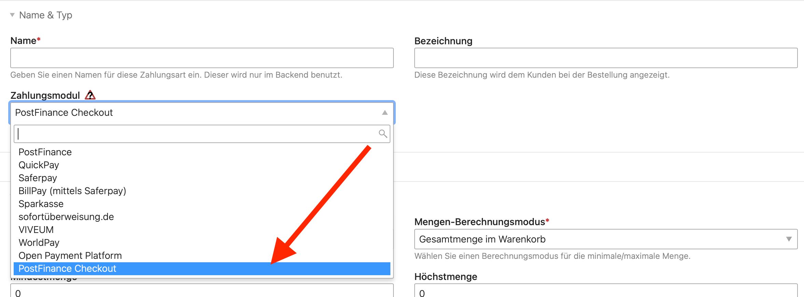

{}
Diese Erweiterung für Isotope eCommerce ist ein kommerzielles Produkt und kann über den
[Marktplatz](https://www.isotopeecommerce.org/de/marktplatz.html) gekauft werden.
{}

**PostFinance Checkout Flex** ist eine Online-Zahlungslösung der Schweizerischen PostFinance.

> Mit PostFinance Checkout Flex erhalten Sie eine flexible und funktionsstarke Payment Service Providing Lösung für Ihren
> Onlineshop erweiterbar mit einem Zahlungsterminal für den stationären Verkauf. Zahlungsarten, Funktionen und Terminals 
> können gemäss Ihren Bedürfnissen konfiguriert werden.

Die Lösung bietet verschiedene Zahlungsmöglichkeiten, darunter Kreditkarten (VISA, MasterCard), PostFinance Card, 
PostFinance E-Finance und TWINT.

## Installation

Die Erweiterung wird als ZIP-Archiv vertrieben, welche über den Contao Manager installiert werden kann. Dazu in der
Paketliste im Manager die Upload-Funktion nutzen, oder die Datei per Drag & Drop hochladen. Nach dem Aktualisieren
der Pakete steht die neue Zahlungsmethode im Isotope Backend zur Verfügung.

## Einrichtung

PostFinance Checkout bietet eine kostenlose Testversion, für welche man sich auf der [Webseite][website] frei registrieren
kann. Mit dem Testkonto kann die volle Funktionalität in Isotope eCommerce getestet werden, erst nach Vertragsabschluss
werden tatsächliche Kosten berechnet und können echte Transaktionen durchgeführt werden.

[Weiterlesen](/de/backend-konfiguration-shop-bestellablauf-zahlungsarten-pfc-einrichtung/)

[marketplace]: https://www.isotopeecommerce.org/de/marktplatz.html
[website]: https://checkout.postfinance.ch/
