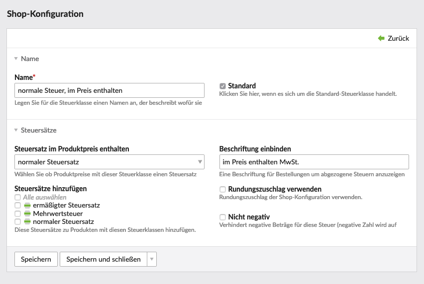

## Name

| Einstellung | Standardeinstellung |                                    Beschreibung                                     |
|-------------|---------------------|-------------------------------------------------------------------------------------|
| Name        | -                   | Lege für die Steuerklasse einen Namen an, der beschreibt wofür sie eingesetzt wird. |
| Standard    | -                   | Klicke hier, wenn es sich um die Standard-Steuerklasse handelt.                     |

## Steuersätze

|              Einstellung               | Standardeinstellung |                                                                                             Beschreibung                                                                                             |
|----------------------------------------|---------------------|------------------------------------------------------------------------------------------------------------------------------------------------------------------------------------------------------|
| Steuerklasse im Produktpreis enthalten | -                   | Wähle ob Produktpreise mit dieser Steuerklasse einen Steuersatz enthalten. Dieser Steuersatz wird vom Produktpreis abgezogen, wenn er nicht passt.                                                   |
| Beschriftung einbinden                 | -                   | Eine Beschriftung für Bestellungen um abgezogene Steuern anzuzeigen (falls eingebundene Steuern nicht passen). Wenn dieses Feld leer ist, wird die Beschriftung des Standard-Steuersatzes angezeigt. |
| Steuersätze hinzufügen                 | -                   | Diese Steuersätze zu Produkten mit diesen Steuerklassen hinzufügen.                                                                                                                                  |
| Rundungszuschlag verwenden             | -                   | Rundungszuschlag der Shop-Konfiguration verwenden.                                                                                                                                                   |
| Nicht negativ                          | -                   | Verhindert negative Beträge für diese Steuer (negative Zahl wird auf 0.00 aufgerundet).                                                                                                              |

## Beispiel 1:

Für den Verkauf an Endverbraucher in Deutschland wird der Bruttopreis angezeigt und die enthaltene Mehrwertsteuer lediglich ausgewiesen.

## Beispiel 2:

Für den Verkauf an Gewerbekunden in Deutschland wird der Nettopreis angezeigt und die normale Mehrwertsteuer addiert.

