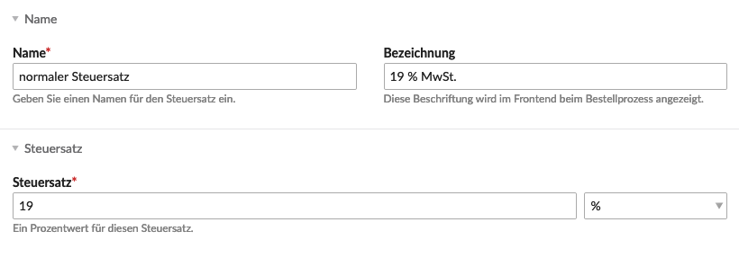
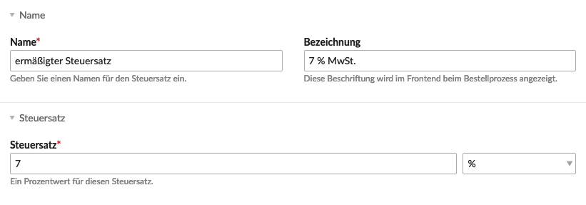

Für eine Shop-Konfiguration muss mindestens ein Steuersatz vorhanden sein.

 
Klicke auf "Neuer Steuersatz" und fülle einfach die Pflichtfelder **Steuersatz-Name**, "Steuersatz" und "Adressbasis für die Berechnung" aus. **Adressbasis für die Berechnung** klingt erstmal seltsam. Steuersätze können von Land zu Land oder Staat zu Staat unterschiedlich sein. Daher wird hier ausgewählt ob die Rechnungs- oder Lieferadresse als Referenz bevorzugt werden soll, oder ob beide Adressen miteinbezogen werden sollen.


<docrobot_new_in_version version="2.3">
	
Dieses Feature ist neu in Isotope eCommerce 2.3

	
Neu kann die USt-IdNr. geprüft werden, falls diese gültig ist kann durch auswählen der entsprechenden Option im Steuersatz verhindert werden, dass die Steuer angewendet wird.

</docrobot_new_in_version>

## Name

| Einstellung | Standardeinstellung |                                          Beschreibung                                          |
|-------------|---------------------|------------------------------------------------------------------------------------------------|
| Name        | -                   | Hier kannst du denn Steuersatz-Namen eingeben.                                                 |
| Bezeichnung | -                   | Die Bezeichnung wird anstelle des Steuersatz-Namens im Frontend beim Bestellprozess angezeigt. |
| Steuersatz  | -                   | Hier kannst du denn Prozentwert für den Steuersatz festlegen.                                  |

## Ort

|          Einstellung           | Standardeinstellung |                                                                 Beschreibung                                                                  |
|--------------------------------|---------------------|-----------------------------------------------------------------------------------------------------------------------------------------------|
| Adressbasis für die Berechnung | Versanadresse       | Wähle auf Basis welcher Adresse dieser Steuersatz berechnet werden soll. Die Versandadresse für nicht versendbare Produkte.                   |
| Länder                         | -                   | Wähle die Länder, auf welche diese Steuerklasse zutrifft.                                                                                     |
| Bundesländer/Staaten/Regionen  | -                   | Wähle die Länder, auf welche diese Steuerklasse zutrifft.                                                                                     |
| Postleitzahlen                 | -                   | Begrenzt den Steuersatz auf Postleitzahlen. Du kannst einen Bereich mit kommaseparierte Liste auswählen (z.B. 1234,1235,1236-1239,1100-1200). |

## Bedingungen

|           Einstellung           | Standardeinstellung |                                            Beschreibung                                            |
|---------------------------------|---------------------|----------------------------------------------------------------------------------------------------|
| Zwischensummen-Wertbeschränkung | -                   | Beschränke diesen Steuersatz auf einen bestimmten Zwischensummen-Wert (z.B. für eine Luxussteuer). |

## Konfiguration

|            Einstellung             | Standardeinstellung |                                                  Beschreibung                                                  |
|------------------------------------|---------------------|----------------------------------------------------------------------------------------------------------------|
| Shop-Konfiguration                 | -                   | Wähle für welche Shop-Konfiguration dieser Steuersatz gilt.                                                    |
| USt-IdNr. bei Gültigkeit befreien. | -                   | Die Steuer nicht anwenden, wenn die USt-IdNr. gültig ist.                                                      |
| Berechnung bei Auslöser beenden    | -                   | Andere Berechnungen beenden, wenn dieser Steuersatz ausgelöst wird.                                            |
| Nur bei Gästen verwenden           | -                   | Diesen Steuersatz für eingeloggte Mitglieder nicht verwenden (ausser die entsprechenden Gruppen sind erlaubt). |
| Steuersatz schützen                | -                   | Diesen Steuersatz nur bestimmten Mitgliedergruppen zuweisen.                                                   |

## Beispiel:

Für den Verkauf in Deutschland kommen zwei Steuersätze in Frage, der normale und der ermässigte (für z. B. Lebensmittel, Bücher, Zeitschriften).

