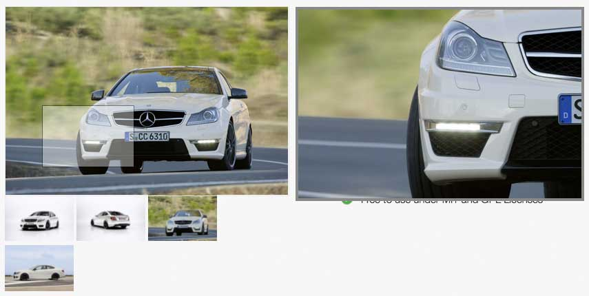

Die Galerie ist praktisch in der Detailansicht eines Produktes und erlaubt das "Zoomen" des Hauptbildes. Eine ausführliche Beschreibung der Galerie findet sich auf der [Herstellerseite des jQuery-Plugins][1].

Die Einstellungen decken sich mehrheitlich mit der <docrobot_route name="gallery-default">Standard Galerie</docrobot_route>.

{}
Dieser Galerietyp unterstützt  das Responsive Images und das Picture Element in Contao <strong>nicht</strong>.
{}

{}
Damit diese Galerie funktioniert, muss jQuery in deinem Seitenlayout eingebunden werden.
{}

[1]: http://www.elevateweb.co.uk/image-zoom
