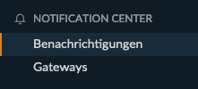

Die Isotope eCommerce-eigenen E-Mail-Benachrichtigungen wurden in das `Benachrichtigungszentrum` ausgelagert . 
Du wirst feststellen, dass du bei Klick auf `Benachrichtigungen` zum entsprechenden Menüpunkt weitergeleitet wirst. Dies wurde eingebaut, um den Einstieg für Isotope 1.4-Kenner zu erleichtern.

Stellst du dir das `Benachrichtigungszentrum` losgelöst von Isotope eCommerce vor, so sollte einiges von Beginn weg klarer erscheinen. Es wurde unabhängig entwickelt und hat sich zum Ziel gesetzt, als zentrale Komponente für beliebige andere Erweiterungen und deren Benachrichtigungen zu fungieren. Die Anforderungen für Benachrichtigungen lassen sich nämlich gemeinsam festhalten:

* Eine Benachrichtigung hat immer einen Auslöser und da bei diesem Auslöser potenziell mehrere verschiedene Nachrichten ausgelöst werden sollen, besteht eine Benachrichtigung aus einer oder mehreren Nachrichten.

{}Merke dir die unterschiedliche Verwendung von <code>Benachrichtigung</code> und einer einzelnen <code>Nachricht</code>. Eine <code>Benachrichtigung</code> ist ein Gefäss von einer oder mehreren <code>Nachrichten</code>.{}

* Eine Nachricht muss potenziell in verschiedene Sprachen übersetzbar sein.
* Eine Nachricht definiert sich nicht durch das Wort "E-Mail". Es ist folglich für eine Nachricht irrelevant wohin oder mit welchem Hilfsmittel (Gateway) sie verschickt wird.
* Eine Nachricht besteht nicht zwingend aus menschenlesbarem Text. Ein Austausch von Maschine zu Maschine kann ebenso als "Nachricht" bezeichnet werden.

Es ergibt sich folgendes Verhalten:

Zu einer einzelnen [Benachrichtigung](/de/backend-konfiguration-shop-allgemein-benachrichtigszentrum-benachrichtigungen/) 
gehören eine oder mehrere [Nachrichten](/de/backend-konfiguration-shop-allgemein-benachrichtigszentrum-nachrichten/), welche 
in verschiedenen [Sprachen](/de/backend-konfiguration-shop-allgemein-benachrichtigszentrum-sprachen/) über ein 
beliebiges [Gateway](/de/backend-konfiguration-shop-allgemein-benachrichtigszentrum-gateways/) versendet werden.
