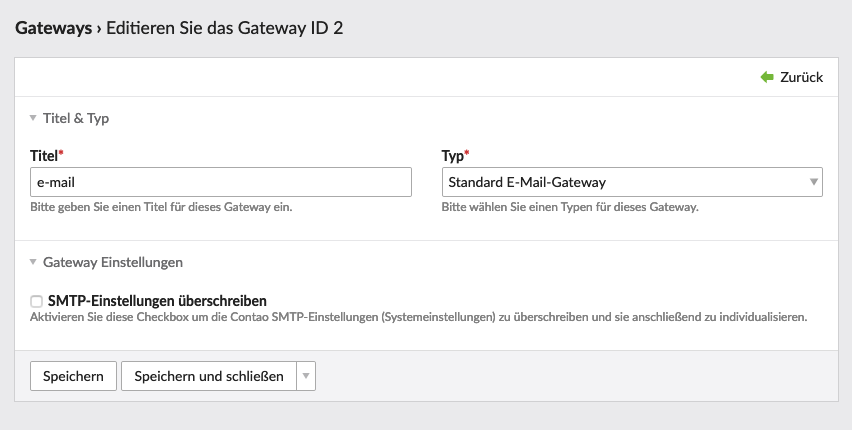

{}
This article is machine translated.
{}

A gateway refers to the path by which a [message]((/de/backend-konfiguration-shop-allgemein-benachrichtigszentrum-nachrichten/))reaches its recipient. Examples of gateways:

- Email
- SMS
- Carrier pigeon
- File Transfer Protocol (FTP)

> Why do I need this?

- SMS notification of a specific department?
- Saving data as CSV file?
- Email to shop admin via other SMTP server as order confirmation to visitors?

> What do I do now?

It can be assumed that the email gateway provided is sufficient for you. So in principle you just create the following configuration and save it:

{}
Without any special settings, Contao tries to send the emails via sendmail[(https://en.wikipedia.org/wiki/Sendmail)](https://en.wikipedia.org/wiki/Sendmail). Depending on your hosting provider, sendmail may not be available and you may have to use an alternative. This could be the direct sending via SMTP. Here you have the option to either overwrite the global Contao settings via `parameters.yml` (note correct indentation and use spaces instead of tabs) or adjust the settings for only one specific gateway.
{}
