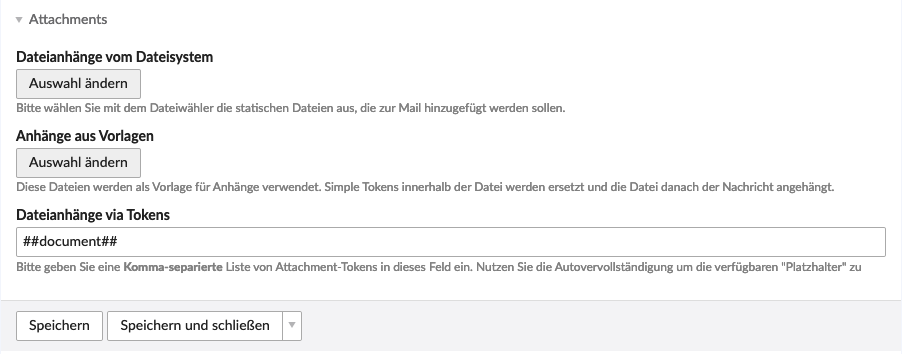

{}
This article is machine translated.
{}

`Sprachen` are, as mentioned in earlier chapters, not necessarily present in every gateway or notification type. For human recipients of messages, however, they are logically of great importance and the `Benachrichtigungszentrum` allows you some settings.

{}
This chapter makes repeated reference to [Simple Tokens](/de/simple-tokens/). In the notification center, an autocomplete function has been added to simplify the use of these very tokens. By tapping "##" you get a selection of the available Simple Tokens as [well as a](/de/simple-tokens/) description of them.
{}

{}
The following settings refer to the gateway "E-Mail". Other gateways may have different settings (e.g. most likely neither "CC address fields" nor "BCC address fields").
{}

### General language settings

<table><thead><tr><th>Setting</th> <th>Default setting</th> <th>Description</th> </tr></thead><tbody><tr><td>Language</td> <td>-</td> <td>Here you select the language you would like to use for the message. Isotope eCommerce is multilingual, so you can define multiple languages or just one.</td> </tr><tr><td>Fallback language</td> <td>-</td> <td>As with the root pages of Contao itself, you can define here if the defined language should act as a fallback. Isotope will try to send the message in the current language. If it does not exist, the fallback language will be used.</td></tr></tbody></table>

### Meta information

<table><thead><tr><th>Setting</th> <th>Default</th> <th>Description</th> </tr></thead><tbody><tr><td>Sender name</td> <td>-</td> <td>Here you can enter a sender name. For example, the name of your webshop.</td> </tr><tr><td>Sender email</td> <td>-</td> <td>Here you can enter the sender email address.</td> </tr><tr><td>Recipient</td> <td>-</td> <td>Here you can either enter an email address or use simple tokens. Multiple entries are allowed comma-separated.</td> </tr><tr><td>CC Recipient</td> <td>-</td> <td>Here you can enter a CC email address. Multiple entries are allowed, separated by commas.</td> </tr><tr><td>BCC recipient</td> <td>-</td> <td>Here you can enter a BCC e-mail address. Multiple entries are allowed, separated by commas.</td></tr></tbody></table>

### Content

<table><thead><tr><th>Setting</th> <th>Default setting</th> <th>Description</th> </tr></thead><tbody><tr><td>Subject</td> <td>-</td> <td>Here you can enter the subject for your email. There are some Simple Tokens available via autocomplete.</td> </tr><tr><td>Mode</td> <td>Text only</td> <td>Here you can choose whether you want to send the email as a text-only version or also as an HTML version. {}
Note that some tokens contain HTML and others do not, such as `cart_text` and `cart_html`.</td> </tr><tr><td>Raw text or HTML</td> <td>-</td> <td>Here you can enter the content for your email. There are some Simple Tokens available via autocomplete.</td></tr></tbody></table>

### Attachments

<table><thead><tr><th>Setting</th> <th>Default setting</th> <th>Description</th> </tr></thead><tbody><tr><td>Attachments from the file system</td> <td>-</td> <td>Here you can optionally attach static files. For example AGB would be conceivable.</td> </tr><tr><td>Attachments via Simple Token</td> <td>-</td> <td>Here you can enter a comma-separated list of <docrobot_route name="simple-tokens">Simple Tokens</docrobot_route>. These <docrobot_route name="simple-tokens">Simple Tok</docrobot_route> ens are provided dynamically by Isotope. <docrobot_message info="warning">The token `##document##` refers to the document setting which was introduced in the chapter <docrobot_route name="notifications">Notifications</docrobot_route>.</docrobot_message></td></tr></tbody></table>
