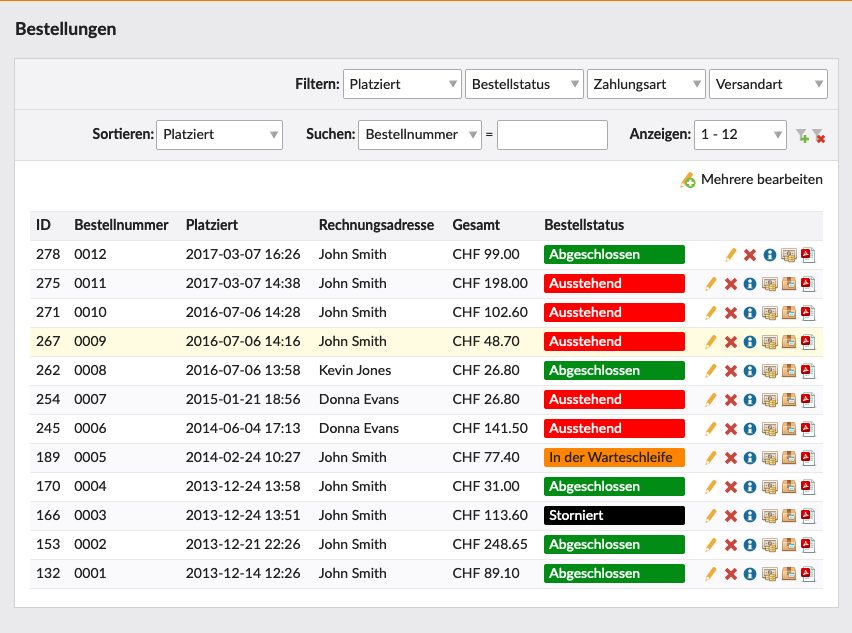
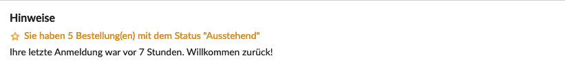

Bei der Installation von Isotope eCommerce werden folgende `Bestellstatus` mit angelegt:

- Pending
- Processing
- Complete
- On Hold
- Cancelled

## Name

<table>
	<thead>
		<tr>
			<th>Einstellung</th>
			<th>Standardeinstellung</th>
			<th>Beschreibung</th>
		</tr>
	</thead>
	<tbody>
		<tr>
			<td>Name</td>
			<td>-</td>
			<td>Hier kannst du einen Namen für den Bestellstatus eingeben, dieser wird im Backend (<docrobot_route name="orders">Bestellungen</docrobot_route>) und Frontend (<docrobot_route name="order-history">Vergangene Bestellungen</docrobot_route> und <docrobot_route name="order-details">Bestellungsdetails</docrobot_route>) ausgegeben.</td>
		</tr>
		<tr>
			<td>Farbe</td>
			<td>-</td>
			<td>Hier kannst du eine Farbe für den Bestellstatus festlegen, um die Übersichtlichkeit im Backend zu erhöhen.</td>
		</tr>
		<tr>
			<td>Die Bestellung wurde bezahlt</td>
			<td>-</td>
			<td>Ist dieses Feld ausgewählt, wird die Bestellung beim Erreichen dieses Status als bezahlt markiert. Somit kann z. B. ein Download-Produkt heruntergeladen werden.</td>
		</tr>
		<tr>
			<td>Auf der Willkommensseite anzeigen</td>
			<td>-</td>
			<td>Zeigt die Anzahl von Bestellungen beim Erreichen dieses Status auf der Backend-Startseite von Contao an.</td>
		</tr>
	</tbody>
</table>

### Farbe

### Auf der Willkommensseite anzeigen

## Benachrichtigung

<table>
	<thead>
		<tr>
			<th>Einstellung</th>
			<th>Standardeinstellung</th>
			<th>Beschreibung</th>
		</tr>
	</thead>
	<tbody>
		<tr>
			<td>Benachrichtigung</td>
			<td>-</td>
			<td>Hier kannst du eine im <docrobot_route name="notifications_overview">Benachrichtigungscenter</docrobot_route> angelegte Benachrichtigung auswählen.</td>
		</tr>
	</tbody>
</table>
