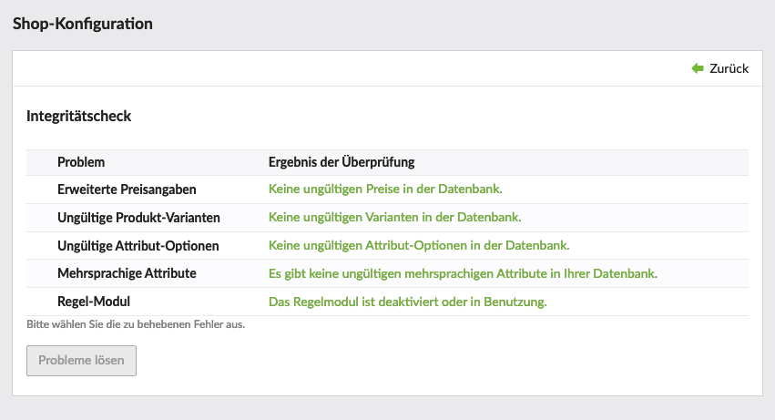



Der Integritätscheck versucht Ungereimtheiten in der Datenbank zu eruieren und bietet wenn möglich auch die Option das Problem automatisiert zu beheben. Ein Beispiel wäre die Konfiguration eines Produkttyps mit Varianten, welcher später wieder auf "variantenlos" umgestellt wird. Dies ergibt überflüssige Varianten in der Datenbank, welche der Integritätscheck erkennt und auf Klick bereinigt.
