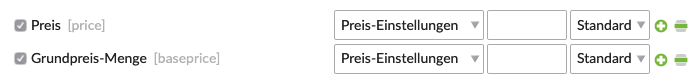
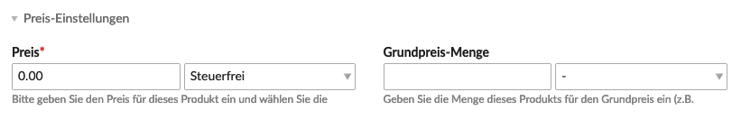

Du kannst für ein Produkt einen Grundpreis (Preis pro Mengeneinheit) festlegen. Im Frontend wird dann zum Preis zusätzlich noch der Grundpreis ausgegeben (CHF 0.25 pro 100 g).

Im ersten Schritt legst du den Grundpreis fest.

<table>
	<thead>
		<tr>
			<th>Einstellung</th>
			<th>Standardeinstellung</th>
			<th>Beschreibung</th>
		</tr>
	</thead>
	<tbody>
		<tr>
			<td>Name</td>
			<td>-</td>
			<td>Weise dem Grundpreis einen eindeutigen Namen zu, dieser wird nur im Backend verwendet.</td>
		</tr>
		<tr>
			<td>Basisbetrag</td>
			<td>-</td>
			<td>Beim Basisbetrag handelt es sich um den Umrechnungsfaktor für den Grundpreis, dieser sollte mit der Zahl in der Bezeichnung identisch sein. z. B. "100 g" ergibt einen Basisbetrag von 100.</td>
		</tr>
		<tr>
			<td>Bezeichnung</td>
			<td>%s</td>
			<td>Hier kannst du die Beschriftung für den Grundpreis eingeben. z. B. "%s pro 100 g". <code>%s</code> ist ein Platzhalter und gibt den berechneten Grundpreis inklusive der in der <docrobot_route name="configuration">Shop-Konfiguration</docrobot_route> gewählten Währung aus.</td>
		</tr>
	</tbody>
</table>

Danach musst du einen <docrobot_route name="product-types">Produkttypen</docrobot_route> mit dem Attribut `Grundpreis-Menge [baseprice]` anlegen.

Beim anlegen eines <docrobot_route name="product-management">Produktes</docrobot_route> stehen dir jetzt zwei Felder zur Verfügung.

<table>
	<thead>
		<tr>
			<th>Einstellung</th>
			<th>Standardeinstellung</th>
			<th>Beschreibung</th>
		</tr>
	</thead>
	<tbody>
		<tr>
			<td>Grundpreis-Menge</td>
			<td>-</td>
			<td>Hier handelt es sich um das Mengentotal des Produktes. Diese Angabe muss in der gleichen Mengeneinheit des Basisbetrages beim Grundpreis eingeben werden. In unserm Beispiel also in Gramm. z. B. Grundpreis-Menge 1000 und Basisbetrag 100 ergeben CHF 0.50 pro 100 g bei einem Verkaufspreis von CHF 5.00.</td>
		</tr>
		<tr>
			<td>Auswahl</td>
			<td>-</td>
			<td>Hier kannst du den gewünschten Grundpreis auswählen.</td>
		</tr>
	</tbody>
</table>
