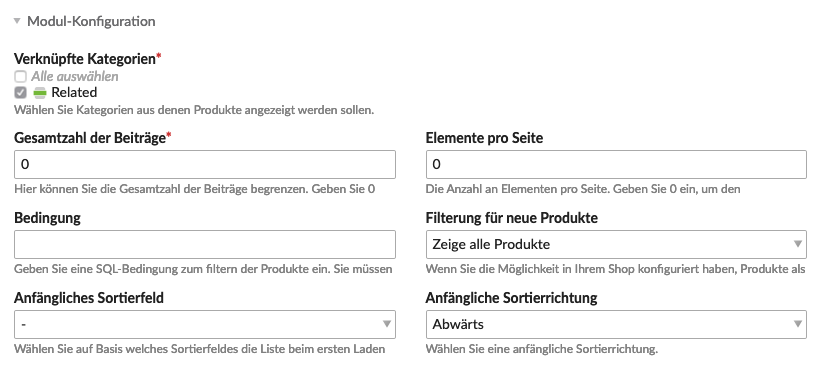

`Verknüpfte Kategorien` werden ausschliesslich im Zusammenhang mit dem Modul 
[Ähnliche Produkte](/de/frontend-konfiguration-module-Ähnliche-Produkte/) verwendet.

Sie bildet die Basis für die von vielen Webshops bekannte Funktion für Dinge wie

* "Kunden die dieses Produkt gekauft haben, kauften auch"
* Zubehör zu diesem Produkt
* etc.

Eine `verknüpfte Kategorie` ist aber nicht für jedes Produkt immer gleich.
Nehmen wir als Beispiel die "Zubehör"-Funktion. Für Produkt A ist das Zubehör die Produkte X und Y, aber für Produkt B sind es Produkte K und L.

Deshalb wird die Zuordnung für die Kategorien im Produkt selbst vorgenommen.
Sobald du **mindestens eine** `verknüpfte Kategorie` angelegt hast, kannst du bei den [Produkten](/de/backend-produkte/) 
selbst, die Verknüpfungen vornehmen.

## Vorgehen beim Einrichten von ähnlichen Produkten

1. Isotope eCommerce > Shop-Konfiguration > Verknüpfte Kategorien  
`Neue Kategorie` mit dem Namen `Related` anlegen.  

3. Isotope eCommerce > [Produkte](/de/backend-produkte/)
Zuerst musst du IDs der ähnlichen Produkte herausfinden, fahre dafür über das blaue Icon 
(). Danach auf `Kategorie hinzufügen`, wähle die Kategorie `Related` aus und füge die Produkte-IDs unter `Produkte` ein.  

4. Module > [Ähnliche Produkte](/de/frontend-konfiguration-module-Ähnliche-Produkte/)
Modul anlegen und unter Modul-Konfiguration `Related` auswählen.  

5. Inhalte > Artikel  
Jetzt das angelegte Modul im Artikel mit [Produktliste](/de/frontend-konfiguration-module-produktliste/) 
und [Produktleser](/de/frontend-konfiguration-module-Produktleser/) platzieren.  

