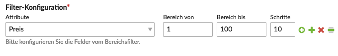



Der `Bereichsfilter` generiert aus den gewählten Filter-Attributen eine Navigation, mit der eine Produktliste eingeschränkt werden kann.

## Beispiel

Als Beispiel dient uns eine Produktliste, bei welcher wir durch ziehen des Bereichsfilter die Anzeige beeinflussen können.

Die Filter-Konfiguration im Modul:

Die Ausgabe im Frontend:

## Modul-Konfiguration

<table>
	<thead>
		<tr>
			<th>Einstellung</th>
			<th>Standardeinstellung</th>
			<th>Beschreibung</th>
		</tr>
	</thead>
	<tbody>
		<tr>
			<td>Kategorie-Anwendungsbereich</td>
			<td>Aktive Kategorie</td>
			<td>Jede einzelne Option ist im Contao-internen Helpwizard () beschrieben.</td>
		</tr>
		<tr>
			<td>Bedingung</td>
			<td>-</td>
			<td>Hier kannst du selber eigene SQL-Bedingungen eingeben, welche an den entsprechenden Query angehängt und ausgeführt werden.</td>
		</tr>
		<tr>
			<td>Filterung für neue Produkte</td>
			<td>Zeige alle Produkte</td>
			<td>Wenn du die Möglichkeit in deinem Shop konfigurierst hast, Produkte als "neu" zu kennzeichnen, kannst du entweder nach alten, neuen oder nach allen Produkten filtern.
			 Auswahl Möglichkeiten:
			<ul>
				<li>Zeige alle Produkte</li>
				<li>Zeige nur die neuen Produkte</li>
				<li>Zeige alte Produkte</li>
			</ul>
			</td>
		</tr>
		<tr>
			<td>Filter-Konfiguration</td>
			<td>-</td>
			<td>Hier kannst du die Felder des Einschränkenden Filters konfigurieren.
				<table>
					<tbody>
						<tr>
							<td>Attribute</td>
							<td>Eine Auswahl der in der Shop-Konfiguration angelegter <docrobot_route name="attributes">Attribute</docrobot_route>.</td>
						</tr>
						<tr>
							<td>Bereich von</td>
							<td>-</td>
						</tr>
						<tr>
                            <td>Bereich bis</td>
                            <td>-</td>
                        </tr>
						<tr>
							<td>Schritte</td>
							<td>-</td>
						</tr>
					</tbod>
				</table>
			</td>
		</tr>
		<tr>
			<td>Einzelne Auswahlen verstecken</td>
			<td>-</td>
			<td>Hier kannst du Felder für den Filter verstecken, wenn nur eine Auswahl vorhanden ist.</td>
		</tr>
	</tbody>
</table>

## Template-Einstellungen

<table>
	<thead>
		<tr>
			<th>Einstellung</th>
			<th>Standardeinstellung</th>
			<th>Beschreibung</th>
		</tr>
	</thead>
	<tbody>
		<tr>
			<td>Individuelles Template</td>
			<td>-</td>
			<td>Hier kannst du das Standard-Template überschreiben lassen.</td>
		</tr>
		<tr>
			<td>Navigationstemplate</td>
			<td>nav_default</td>
			<td>Hier kannst du ein Template für den Filter auswählen und die Ausgabe so verändern. Wie im Beispiel erklärt, generiert dieser Filter eine Navigation, weshalb hier alle Navigationstemplates zur Auswahl zur Verfügung stehen.</td>
		</tr>
		<tr>
			<td>Nachrichten einbinden</td>
			<td>-</td>
			<td>Wird diese Option aktiviert, so werden die Fehler und Hinweise direkt im Modul und nicht als JavaScript-Overlay ausgegeben.</td>
		</tr>
		<tr>
			<td>Ausblenden bei Produktansicht</td>
			<td>-</td>
			<td> Diese Option blendet den Produktfilter aus, wenn ein Produkt-Alias in der URL gefunden wurde.</td>
		</tr>
	</tbody>
</table>

## Weiterleitung

<table>
	<thead>
		<tr>
			<th>Einstellung</th>
			<th>Standardeinstellung</th>
			<th>Beschreibung</th>
		</tr>
	</thead>
	<tbody>
		<tr>
			<td>Weiterleitungs-Seite</td>
			<td>-</td>
			<td> Wenn du hier eine Seite auswählst, wird der Besucher beim Abschicken des Filters auf diese Seite weitergeleitet. {}
Da die Filtereinstellungen zwischengespeichert werden, ist die Platzierung des Filters unerheblich. Das ändert sich aber, sobald du Suchfelder aktivierst. Suchanfragen werden nicht zwischengespeichert und es ist deshalb notwendig, dass der Produktfilter <strong>vor der Produktliste auf der gleichen Seite</strong> eingebunden wird!
{}</td>
		</tr>
	</tbody>
</table>

## Referenzseite

<table>
	<thead>
		<tr>
			<th>Einstellung</th>
			<th>Standardeinstellung</th>
			<th>Beschreibung</th>
		</tr>
	</thead>
	<tbody>
		<tr>
			<td>Eine Referenzseite festlegen</td>
			<td>-</td>
			<td> Wenn du eine Referenzseite angibst, bezieht sich der "Kategorie-Anwendungsbereich" in der Modul-Konfiguration nicht auf die aktuelle Seite, sondern auf die ausgewählte Referenzseite. Ein Beispiel könnte eine Seite "Highlights" sein, zu der gewisse Produkte zugewiesen werden. Möchtest du diese jetzt auf der Startseite ausgeben, so wählst du bei "Kategorie-Anwendungsbereich" die "Aktive Kategorie" und wählst bei der Referenzseite die Seite "Highlights" aus.</td>
		</tr>
	</tbody>
</table>
