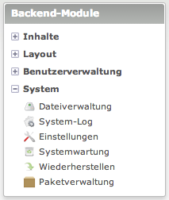
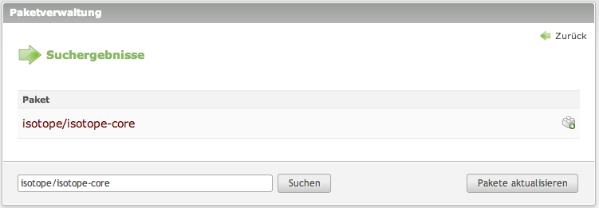
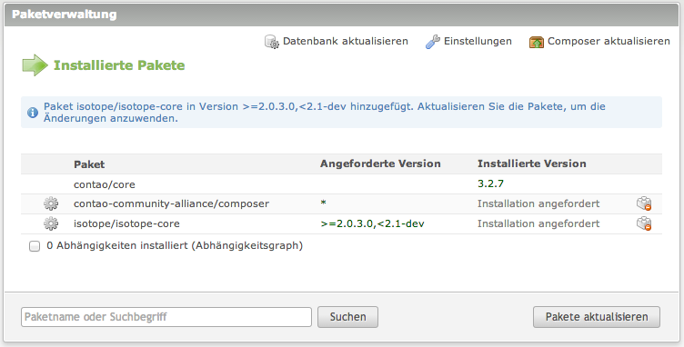
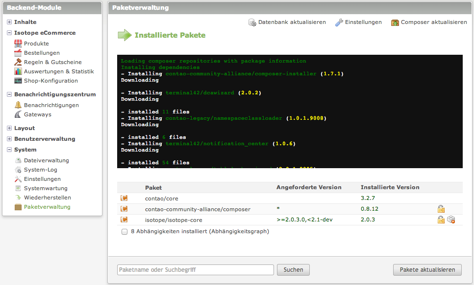

Isotope eCommerce lässt sich auch über [Composer][1] ([Fragen im Forum][2] & [Informationen im Wiki][3]) installieren. Klicke dazu auf `Erweiterungsverwaltung` im Backend.

Auf einer ganz frischen Contao Installation sieht das ungefähr so aus:

Klicke oben rechts auf `Erweiterung installieren`.

Danach gebe als Name der Erweiterung `composer` ein, achte auf die korrekte Schreibweise und das Isotope eCommerce mit deiner Contao-Version kompatibel ist. 

Nach einem Klick auf `Weiter` kannst du die gewünschte Version auswählen. Du solltest die letzte Stable-Versionen einsetzen. Achte auf das Schlüsselwort `stable` beim auswählen der Version. Hier wird die Version `0.8.12 stable` installiert:

Folge den weiteren Schritten. Nach erfolgreicher Installation, sollte der Navigationspunkt `Paketverwaltung` die `Erweiterungsverwaltung` und den `Erweiterungskatalog` ersetzen.

Danach klickst du auf `Paketverwaltung` und wirst gebeten Composer zu installieren.

Im nächsten Fenster wird unter `Preconditions` angezeigt ob dein Server die Systemvoraussetzung erfüllt. Beim `Migration setup` wählst du zum einen `Remove packages` (bei einer Installation ohne Erweiterungen) oder `Upgrade packages to Composer` und zum anderen `For production use`.

Klicke unten auf `do migration`.

Jetzt kommst du zur eigentlichen Installation von Isotope eCommerce.

Bei "Paketname oder Suchbegriff" tippst du `isotope/isotope-core` ein und bestätigst mit einem klick auf `Suchen`.

Das Paket zur Installation vormerken, indem du auf den Namen klickst.

Du wählst die Version `<docrobot_current_version>.*` aus und änderst nichts an der Einstellung `Bugfix Releases <docrobot_current_version>.*` und klickst `Paket zur Installation vormerken`.

`Paket aktualisieren` klicken und warten.

War die Installation von Isotope eCommerce erfolgreich, solltest du nun die neuen Navigationspunkte sehen:

Im letzten Schritt, aktualisierst du noch die Datenbank. Dazu rufst du `http://www.domain.tld/contao/install.php` auf, gibst dein bei der Installation gewähltes `Passwort` ein und klickst auf `Datenbank aktualisieren` und kehrst danach ins Backend zurück.

Nun kannst du mit dem [konfigurieren deines Webshops](/de/backend/) beginnen.

[1]: http://c-c-a.org/ueber-composer
[2]: https://community.contao.org/de/forumdisplay.php?168-composer
[3]: http://de.contaowiki.org/Composer
