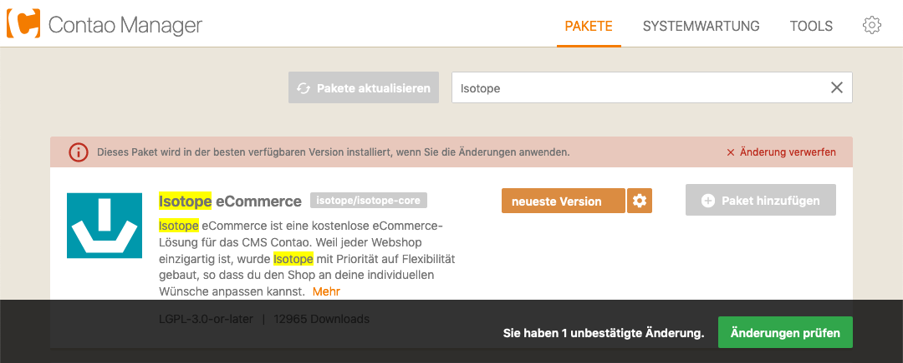
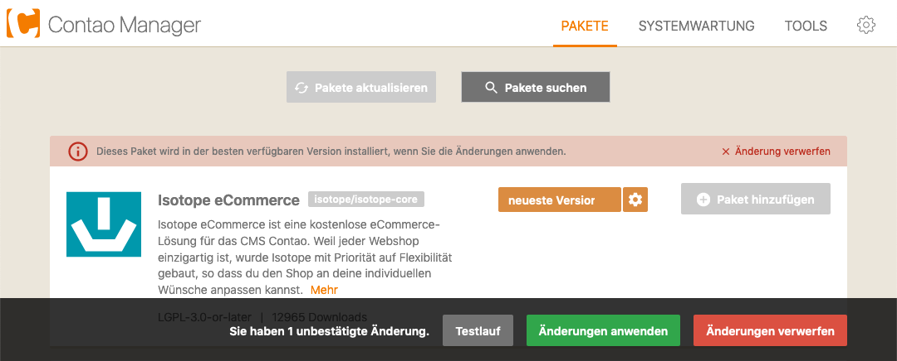
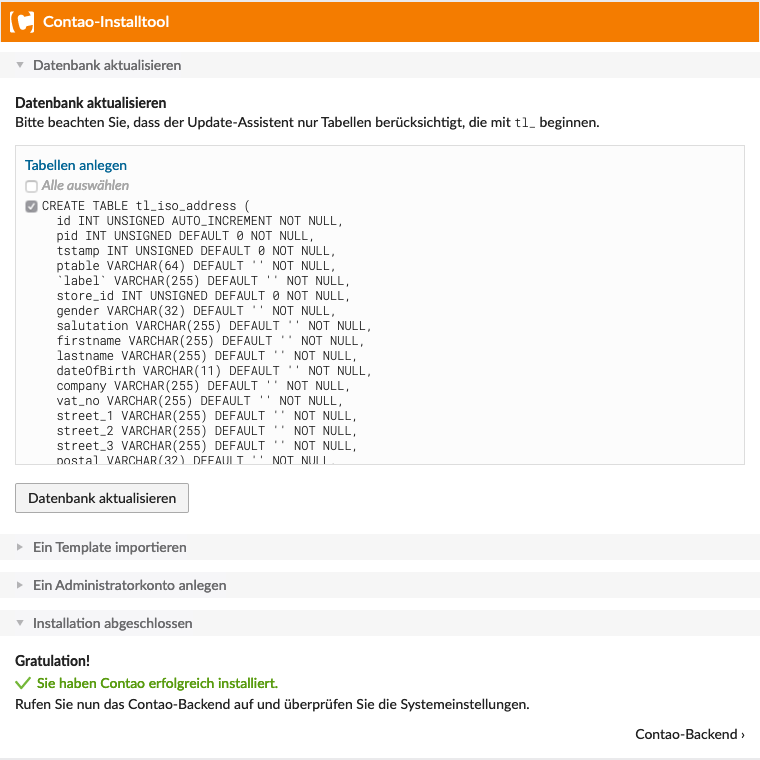

{}
Falls du die Demo von Isotope installieren möchtest, dann folge [dieser Anleitung](https://www.isotopeecommerce.org/de/demo.html).
{}

Isotope eCommerce lässt sich wie zahlreiche andere Erweiterungen für Contao bequem über den Contao Manager installieren.

Rufe dazu den Contao Manager auf. Die gewünschte Contao-Version hast du bereits über den Contao Manager installiert.

`https://www.domain.tld/contao-manager.phar.php`

Nachdem die Systemprüfung durchgelaufen ist, starten wir den Contao Manager.

Klicke auf die Schaltfläche `Pakete suchen`.

Tippe `Isotope` in das Suchfeld und klicke danach bei `Isotope eCommerce - isotope/isotope-core` auf `Paket hinzufügen`.

Jetzt haben wir 1 unbestätigte Änderung, welche wir durch klick auf `Änderungen prüfen` untersuchen lassen.

Mit klick auf `Änderungen anwenden` wird Isotope eCommerce auf deinem System installiert.

Im letzten Schritt, aktualisierst du noch die Datenbank. Dazu rufst du `https://www.domain.tld/contao/install` auf, gibst 
dein bei der Installation gewähltes `Passwort` ein und klickst auf Datenbank aktualisieren und kehrst danach ins Backend zurück.

Viel Spass mit Isotope eCommerce!
