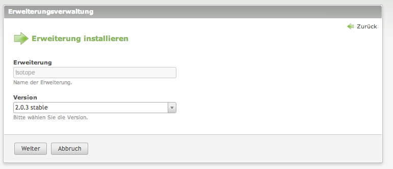
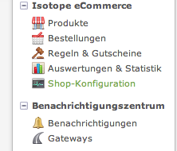

Isotope eCommerce lässt sich wie zahlreiche andere Extensions zu Contao bequem via Extension Repository installieren.
Der einfachste Weg dafür beginnt mit einem Klick auf `Erweiterungsverwaltung` im Backend.

Auf einer ganz frischen Contao Installation sieht das ungefähr so aus:

Klicke oben rechts auf `Erweiterung installieren`.

Der nächste Screen ermöglicht dir, die Eingabe der gewünschten Erweiterung. Hier tippst du `isotope`, achte auf die korrekte Schreibweise und das Isotope eCommerce mit deiner Contao-Version kompatibel ist:

Nach einem Klick auf `Weiter` kannst du die gewünschte Version auswählen. Du solltest für den Produktivbetrieb niemals Beta-Versionen einsetzen. Achte also auf das Schlüsselwort `stable` und versuche, mit Hilfe des [offiziellen Blogs][1] auf dem neusten Stand zu bleiben. Hier wird die Version `2.0.3 stable` installiert:

Folge den weiteren Schritten und führe das Datenbank-Update durch. War die Installation erfolgreich, solltest du nun die neuen Navigationspunkte sehen:

Ob auch wirklich die richtige Version von Isotope eCommerce installiert wurde, kannst du mit einem Klick auf `Shop-Konfiguration` feststellen. Die installierte Version von Isotope eCommerce wird gleich im Titel angezeigt:

Das war bereits alles. Nun kannst du mit dem [konfigurieren deines Webshops](/de/backend/) beginnen.

[1]: http://isotopeecommerce.org/de/blog.html
