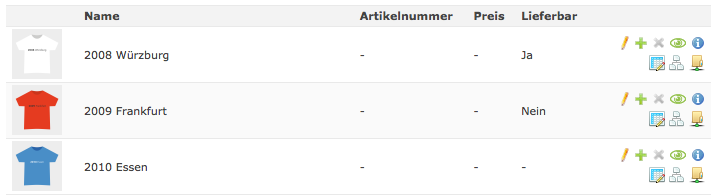
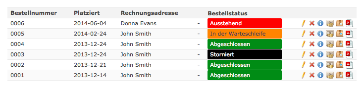
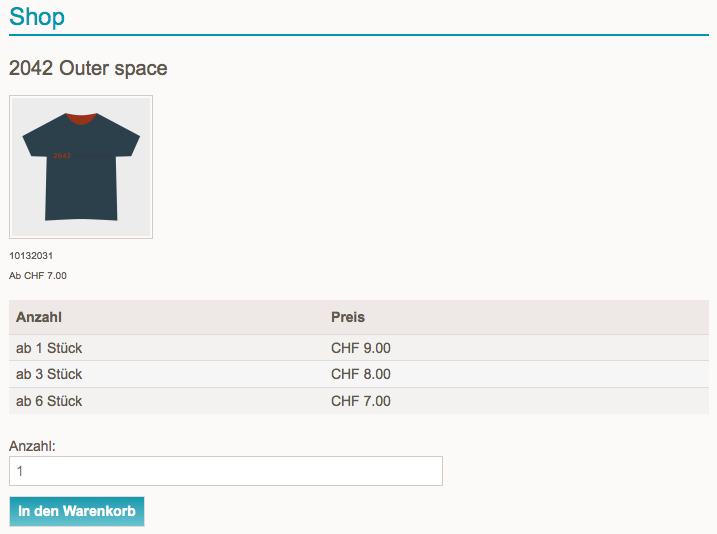

{}
This article is machine translated.
{}

## Set up minimum order quantity

The minimum order quantity is set up as follows:

In Product [Type](/de/backend-konfiguration-shop-Produkttypen/) under **Prices**, please enable **Extended** Pricing.

Then in [Product](/de/backend-produkte/) under **Price Settings** adjust the quantity in the price scales.

## Customize Isotope text output in frontend

You want to customize the output of a text given by Isotope in the frontend.

On GitHub, enter the word you want to change in the search box.


Copy the code line into your `system/config/langconfig.php` and replace "Buy" with "Order for a fee".

```php
$GLOBALS['TL_LANG']['MSC']['confirmOrder'] = 'Kostenpflichtig bestellen';
```

For a multilingual site, the code must look like this:

```php
if ($GLOBALS['TL_LANGUAGE'] == 'de')
{
    $GLOBALS['TL_LANG']['MSC']['confirmOrder'] = 'Kostenpflichtig bestellen';
}
elseif ($GLOBALS['TL_LANGUAGE'] == 'en')
{
   $GLOBALS['TL_LANG']['MSC']['confirmOrder'] = 'Order';
}
```


## Output orders with additional attribute in the backend.

Create an attribute with the following properties:

<table><thead><tr><th>Setting</th> <th>Value</th> </tr></thead><tbody><tr><td>Name</td> <td>Available</td> </tr><tr><td>Internal name</td> <td>deliverable</td> </tr><tr><td>Type</td> <td>Radio Button Menu</td> </tr><tr><td>Options Wizard</td> <td> <table><thead><tr><th>Value</th> <th>Name</th> </tr></thead><tbody><tr><td>Yes</td> <td>Yes</td> </tr><tr><td>No</td> <td>No</td> </tr></tbody></table>

</td></tr></tbody></table>

Then activate the attribute in the product type.

Copy the following code into your `system/config/dcaconfig.php`.

```php
if(is_array($GLOBALS['TL_DCA']['tl_iso_product']['list']['label']['fields']))
{
    if(!in_array('lieferbar',$GLOBALS['TL_DCA']['tl_iso_product']['list']['label']['fields']))
        $GLOBALS['TL_DCA']['tl_iso_product']['list']['label']['fields'][] = 'lieferbar'; 
} 
```

The result

Many thanks to [Spooky](https://community.contao.org/de/member.php?9203-Spooky).

## Display orders with time in the backend

Copy the following code into your `system/config/dcaconfig.php`.

```php
$GLOBALS['TL_DCA']['tl_iso_product_collection']['fields']['locked']['eval']['rgxp'] = 'datim';
```

Before

After

## Display scale price table in the product view

Copy the following code at the desired position into `iso_reader_default.html5`.

```php
<?php echo $this->generateAttribute('price_tiers'); ?>
```



## Test orders cannot be deleted?

There is deliberately no button for this in the backend, as actual orders should never be deleted. These will then only be marked as cancelled due to the traceability. To delete test orders before the launch, empty (SQL query `TRUNCATE`) all tables in the database that begin with `tl_iso_product_collection`.
